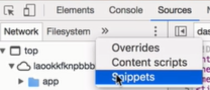
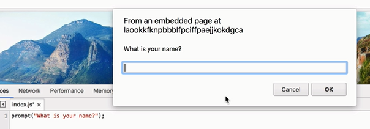
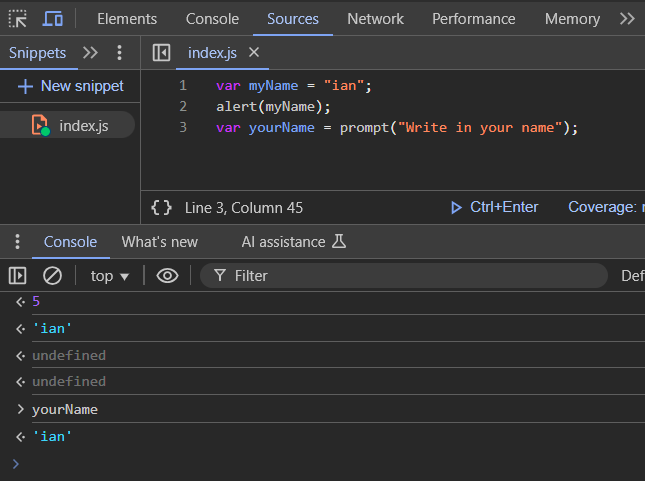
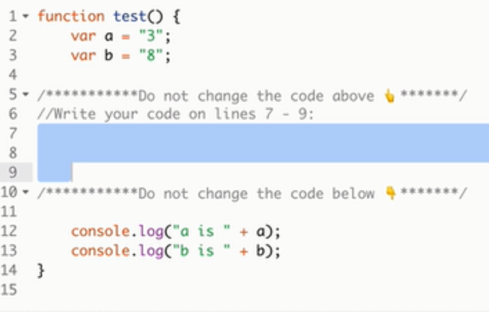
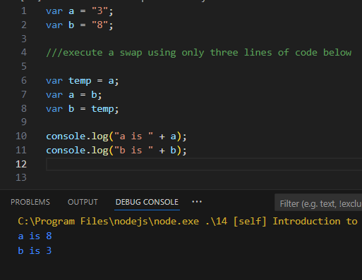
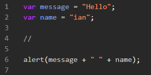
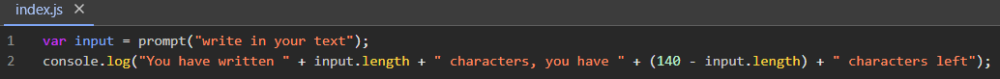
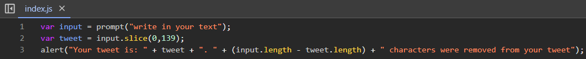
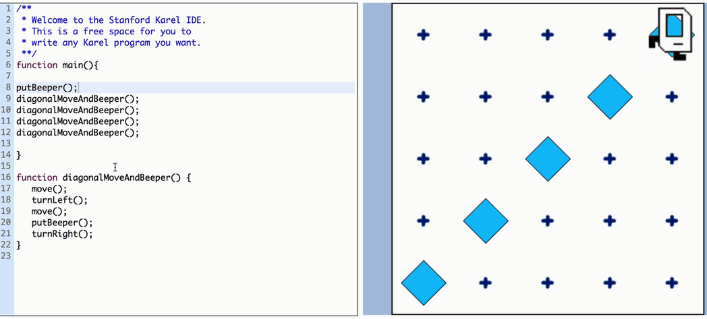

/////////////////////
14.3

/////////////////////
14.4

/////////////////////
14.9

/////////////////////
14.10

/////////////////////
14.11

/////////////////////
14.18 (https://stanford.edu/~cpiech/karel/ide.html)

