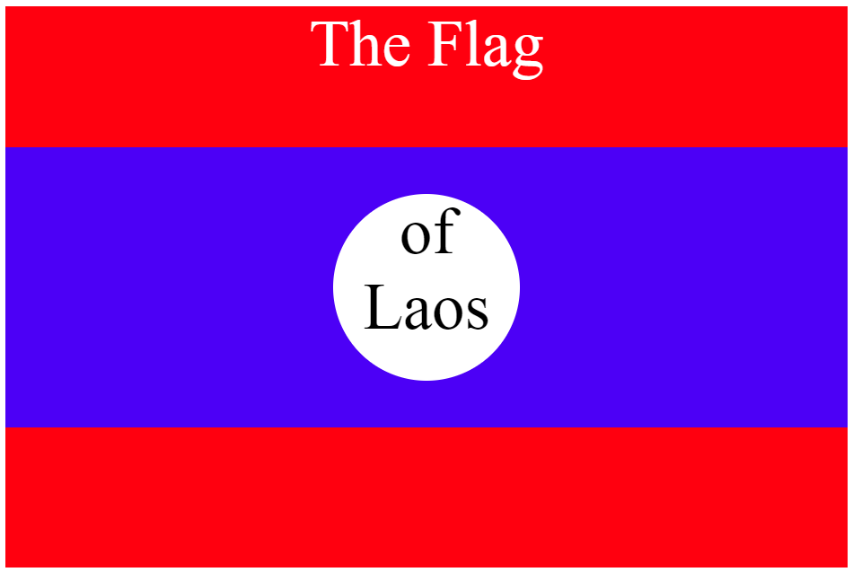
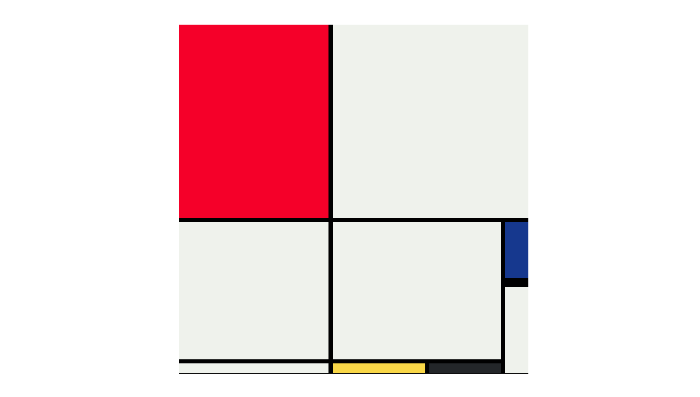
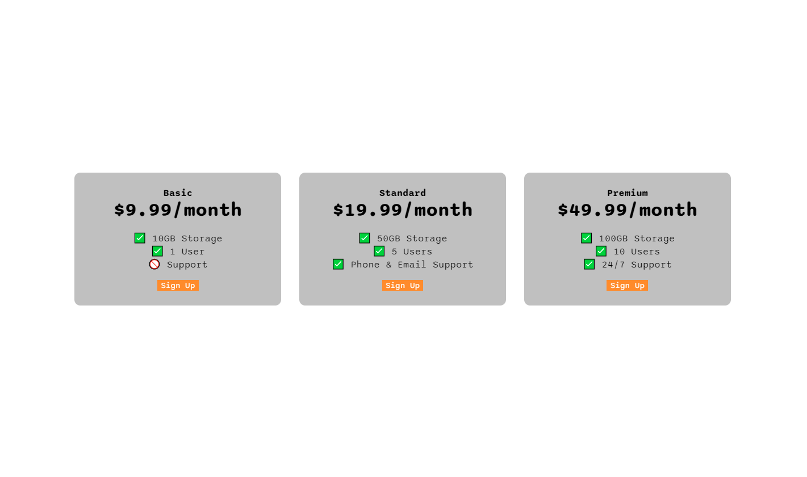
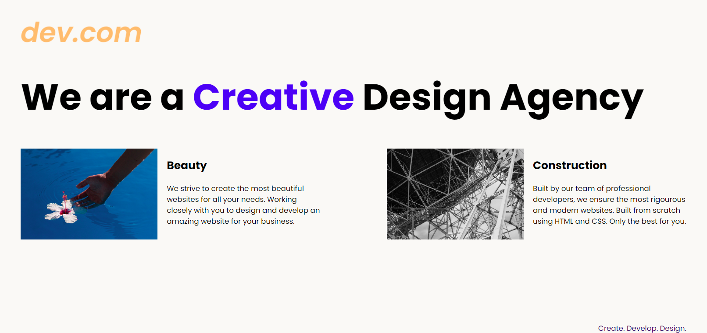
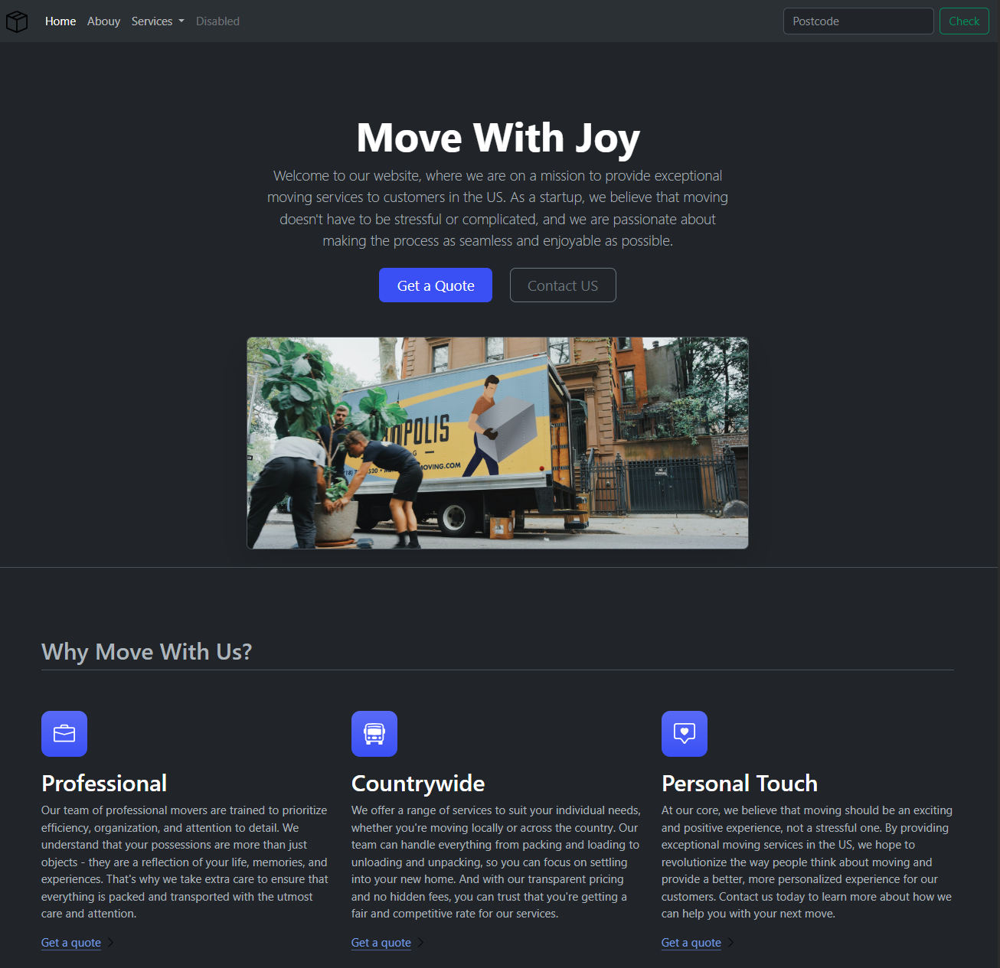
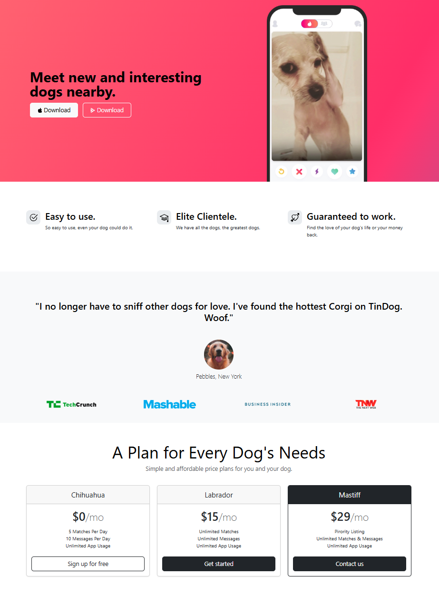
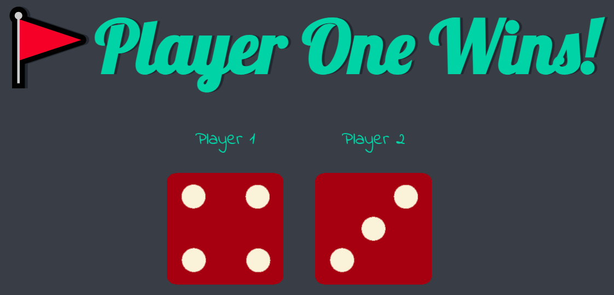
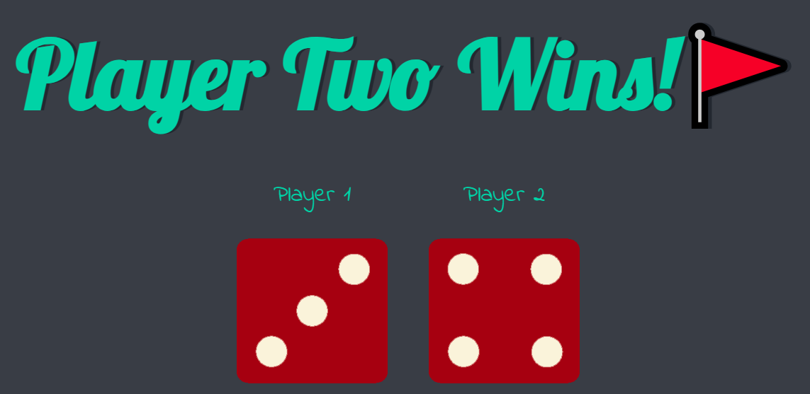
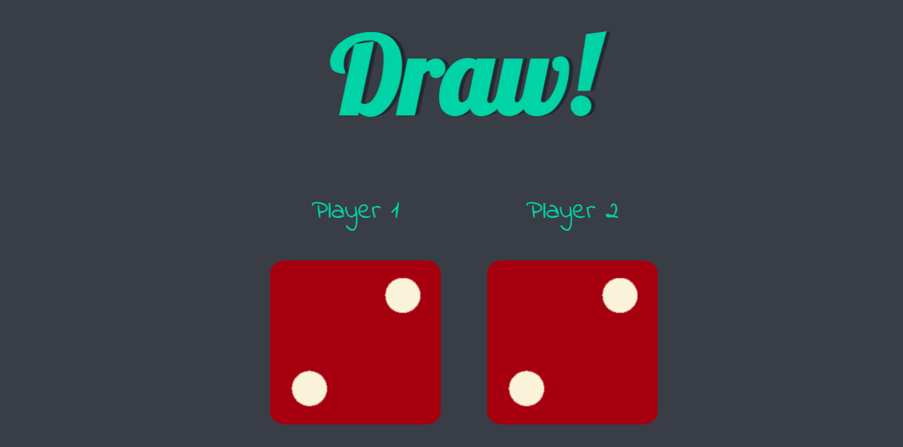
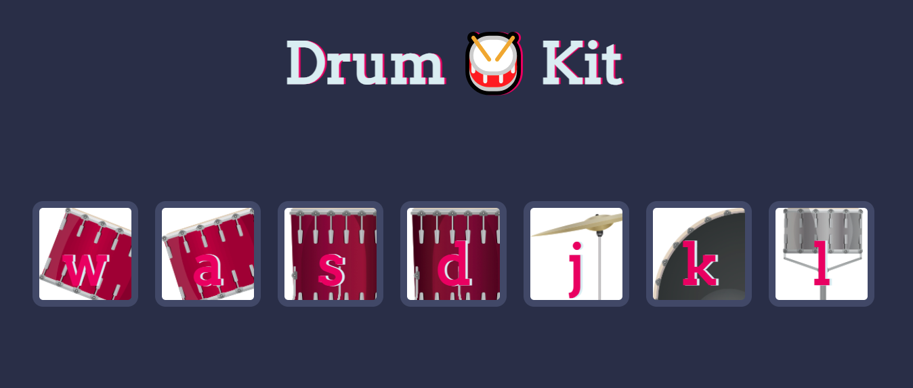

# My.Frontend.Portfolio
# 🎨 HTML & CSS Projects

Welcome to my frontend project showcase!  
This repository highlights my progress in mastering HTML, CSS, layout design, and responsive web development.

---

### 1. Flag of Laos  
A pixel-perfect recreation of the Laos national flag using only HTML and CSS.

**Key Concepts:**  
🔹 Box Model  
🔹 Background Colors & Flexbox  

📁 [View Code](./HTML%20+%20CSS%20Projects/CSS%20Flag%20Project/index.html)

---

### 2. Mondrian Painting  
A CSS grid-based recreation of a Piet Mondrian-style painting.

**Key Concepts:**  
🔹 CSS Grid  
🔹 Positioning  
🔹 Layering and Layouts  

📁 [View Code](./HTML%20+%20CSS%20Projects/Mondrian%20Project/index.html)

---

### 3. Pricing Table  
A simple and responsive pricing table layout for a product/service.

**Key Concepts:**  
🔹 Flexbox  
🔹 Card Design  
🔹 Button Styling  
🔹 Responsive Units  

📁 [View Code](./HTML%20+%20CSS%20Projects/Flexbox%20Pricing%20Table%20Project/index.html)

---

### 4. Web Design Agency Site  
A responsive landing page for a fictional web design agency with media queries for mobile optimization.

**Key Concepts:**  
🔹 Responsive Design  
🔹 Media Queries  
🔹 Typography & Layout  
🔹 Semantic HTML  

📁 [View Code](./HTML%20+%20CSS%20Projects/Web%20Design%20Agency%20Project/)

---

## 📦 Bootstrap Projects

### 1. Moving Company 
Built a fictional moving service site using Bootstrap's prebuilt components and grid system.

**Key Concepts:**
🔹 Navbar: Responsive navigation bar with dropdown menu and collapsible toggle on smaller screens.

🔹 Hero Section: Center-aligned content with call-to-action buttons and an illustrative image.

🔹 Features Grid: Three-column layout using Bootstrap's responsive grid and card-like components to highlight professionalism, national service, and a personal touch.

🔹 Carousel: Image slider displaying customer-oriented lifestyle imagery using the Bootstrap Carousel component.

🔹 Footer: Responsive multi-column footer layout for site navigation and branding.

🔹 Form & Button Elements: Implemented search functionality and styled action buttons with Bootstrap utility classes.

🔹 Theme: Dark mode enabled via data-bs-theme="dark" on <html>.

 

📁 [View Code](./Bootstrap%20Projects/Bootstrap%20Components/index.html)

---

### 2. TinDog Fictional App Website
Built a Bootstrap Frontend showcasing a fictional mobile application.

📁 [View Code](./Bootstrap%20Projects/TinDog%20Project/)

# ⚙️ Javascript

### 1. Introduction to Javascript
This project serves as an introduction to JavaScript, focusing on core programming concepts and real-world applications like string manipulation, user input handling, and function creation. Below are some key learning points:

🔹 Variable Declaration and Assignment

🔹 Swapping Values Using Temporary Variables

🔹 String Length and User Input

🔹 String Slicing

🔹 Converting Strings to Uppercase and Lowercase

🔹 Capitalizing User Input

🔹 Mathematical Operations

🔹 Creating Functions

🔹 Calling Functions Within Other Functions

📁 [View Code](./Javascript%20Projects/1.%20Introduction%20to%20Javascript/index.js)

---

### 2. Intermediate Javascript

🔹 Pseudo Random Number Generator for Simulating a Die Roll

🔹 Control Flow with Conditional Statements

🔹 Leap Year Determination

🔹 Array Operations: Checking if a Name is on a Guest List

🔹 FizzBuzz with a While Loop, If-Else Loop, & For Loop

🔹 Fibonacci Sequence Generator

📁 [View Code](./Javascript%20Projects/2.%20Intermediate%20Javascript/index.js)

---

### 3. The Document Object Model (DOM)
Key learning points:

🔹 Selecting Elements in the DOM, Storing elements in variables, Navigating through child elements

🔹 Modifying Elements, Modifying innerHTML, Modifying styles, Interacting with form elements

🔹 Selecting Specific Elements

🔹 Key principles of "Separation of Concerns"

📁 [View Code](./Javascript%20Projects/3.%20The%20Document%20Object%20Model/index.js)

---

### 4. Dicee Challenge Project
Dice rolling game that selects a winner based on the die roll with th higher value.

📁 [View Code](./Javascript%20Projects/4.%20Dicee%20Challenge%20Project/index.js)

---

### 5. Drum Kit Project
Implemented event handlers/listeners to create drum kit website, where drums sounds triggered by clicks.

📁 [View Code](./Javascript%20Projects/5.%20Drum%20Kit%20Project/index.js)

---

## 🧑‍💼 About Me
I'm a Computer Science & Engineering student at Óbuda University in Budapest, Hungary. I'm passionate about frontend development and am actively building projects using HTML, CSS, JavaScript, and modern frameworks like React (coming soon!).

[Portfolio Site](#)
